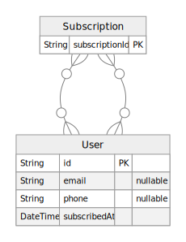

# motivation-quote-generator

Need some quotes to help you go about your day?

## Motive

As a college student, I am often stressed and need motivation to push through my classes and exams.

It is very difficult to find yourself the time to motivate yourself and that is precisely why I built this application!

## Developer

Hey I'm Minsoo! I'm a software engineer based in California. I like to weightlift or boulder after a long day of coding :) You can connect with me on [LinkedIn](https://www.linkedin.com/in/minsookime/) or my [Github](https://github.com/minsooerickim).

 

## Tech Stack

### 💻 Frontend

### ☁️ Hosting/SaaS

- [Fly.io](https://fly.io/)

### 🗣Languages

### ⚙️ Database

### 🧗🏿‍♂️ ORM

### 🚴🏼‍♂️ Devops

- [Husky](https://typicode.github.io/husky/#/)

### 💅🏽 Design

## Entity Relationship Diagram

